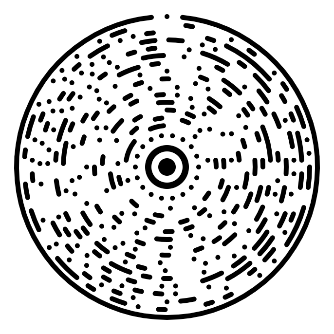
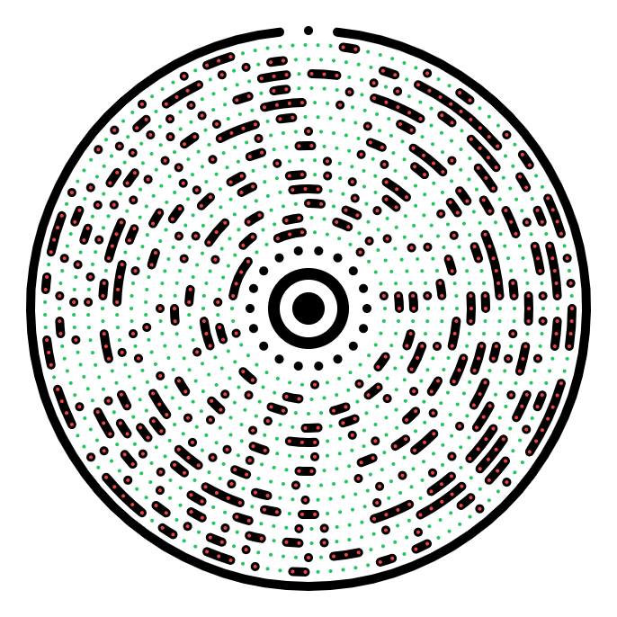

# Ocode — Circular 2D Data Matrix

<div align="center">


[](https://ys1374.github.io/Ocode/)
[](LICENSE)
[](https://www.typescriptlang.org/)
[](https://react.dev/)

**An open-source circular 2D barcode — data encoded in flowing arcs, not a pixel grid.**

[**→ Try it live**](https://ys1374.github.io/Ocode/) · [Report a bug](https://github.com/ys1374/Ocode/issues) · [Suggest a feature](https://github.com/ys1374/Ocode/issues)

</div>

<div align="center">
  
  
</div>

---

## What is Ocode?

Ocode reimagines the QR code. Instead of encoding data as black squares on a square grid, Ocode maps bits onto **concentric arcs** arranged around a central bullseye. A filled arc segment means binary `1`; a gap means `0`. The result is a visually distinct, circular symbol that carries the same information — and uses the same proven Reed-Solomon error correction — as a traditional QR code.

```
         ●●●●●●●●●
      ●●             ●●
    ●●    ██████    ●  ●
   ●    ██      ██    ●●
  ●   ██  ████  ██    ●
  ●   ██  ████  ██     ●
  ●   ██  ████  ██    ●    ← bullseye (Zone 1)
   ●    ██      ██   ●
    ●●    ██████  ●●●        ← timing dots (Zone 2)
      ●●   ██████  ●●       ← data arcs (Zone 3)
         ●●●●●●●●●          ← outer container + sync gap (Zone 4)
```

---

## Features

| Feature | Detail |
|---|---|
| 🔵 **Circular Arc Encoding** | Data maps to polar coordinates, not a Cartesian grid |
| 🛡️ **Reed-Solomon ECC** | Levels L / M / Q / H — up to 60 % damage recovery |
| ⚡ **100 % Client-Side** | Encode and decode in the browser; no data leaves your device |
| 📷 **Camera Scanning** | Decode from live camera feed or uploaded image |
| 🧮 **Zero Core Dependencies** | GF(2⁸) arithmetic implemented from scratch |
| 🎨 **SVG Output** | Scales perfectly to any size |
| 🔧 **TypeScript** | Fully typed, tree-shakeable codebase |

---

## Anatomy of an Ocode

An Ocode is divided into four concentric functional zones:

```
  ┌──────────────────────────────────────────────────────┐
  │                    ZONE 4 (outer ring)               │
  │        ┌─────────────────────────────────────┐       │
  │        │     ZONE 3 (data arc rings)         │  ◉ ← sync dot
  │        │   ┌─────────────────────────┐       │       │
  │        │   │  ZONE 2 (timing ring)   │       │       │
  │        │   │   ┌───────────────┐     │       │       │
  │        │   │   │   ZONE 1      │     │       │       │
  │        │   │   │  (bullseye)   │     │       │       │
  │        │   │   └───────────────┘     │       │       │
  │        │   └─────────────────────────┘       │       │
  │        └─────────────────────────────────────┘       │
  └──────────────────────────────────────────────────────┘
```

### Zone 1 — Bullseye (Center Finder)

Three alternating black-white-black concentric circles at radii **18 / 32 / 45 px** (native scale). The scanner computes the centroid of dark pixels to lock onto the exact geometric centre `(Cₓ, Cᵧ)`.

### Zone 2 — Timing Ring

Twelve equally-spaced dots at radius **65 px** (every 30°). Used to validate that the target is an Ocode and to confirm scale.

### Zone 3 — Data Arcs

Concentric rings starting at **r₀ = 85 px**, stepping outward by **Δr = 10 px**. Each ring holds:

```
N_r = floor(2π · r / δ)   bits
```

where `δ` is the minimum angular dot pitch. Contiguous `1`-bits are merged into a single SVG `<path>` arc, keeping file size small.

### Zone 4 — Container Ring + Sync

A solid outer ring encloses the data. A **sync gap** (notch) is cut at θ = 0°. During decoding the scanner locates this bright notch to determine the rotational zero-offset `θ_offset`, which anchors every bit-sample angle.

---

## How It Works

### Encoding

```
 UTF-8 string
     │
     ▼
 ┌────────────┐
 │  Header    │  2-byte length  +  magic byte 0x4F
 └────────────┘
     │
     ▼
 ┌────────────────────────────┐
 │  Reed-Solomon ECC (GF2⁸)  │  generator g(x) = ∏(x − αⁱ), i = 0..t-1
 └────────────────────────────┘
     │
     ▼
 ┌───────────────────────┐
 │  Bit → Arc Mapping    │  ring by ring, angle by angle
 └───────────────────────┘
     │
     ▼
   SVG output
```

**Error correction levels:**

| Level | ECC Overhead | Recovers up to |
|---|---|---|
| L | ~7 % | Light damage |
| M | ~30 % | Moderate damage |
| Q | ~50 % | Heavy damage |
| H | ~60 % | Severe damage |

### Decoding

```
 Canvas / image
     │
     ▼  centroid of dark pixels
 ┌──────────────────────┐
 │  Center Detection    │
 └──────────────────────┘
     │
     ▼  radial brightness profile → peak = Rmax
 ┌──────────────────────┐
 │  Scale Estimation    │
 └──────────────────────┘
     │
     ▼  scan perimeter for bright notch
 ┌──────────────────────┐
 │  Rotational Sync     │  θ_offset
 └──────────────────────┘
     │
     ▼  sample pixel at (Cₓ + r·cos(θ+θ_off), Cᵧ + r·sin(θ+θ_off))
 ┌──────────────────────┐
 │  Bit Sampling        │
 └──────────────────────┘
     │
     ▼  Berlekamp-Massey → Chien search → Forney
 ┌──────────────────────┐
 │  RS Error Correction │
 └──────────────────────┘
     │
     ▼  validate magic byte 0x4F + length
 Decoded string
```

The sample point formula for ring `r`, slot `j`:

```
Pⱼ = ( Cₓ + r·cos(2πj/Nᵣ + θ_offset),
        Cᵧ + r·sin(2πj/Nᵣ + θ_offset) )
```

A dark pixel → bit `1`; a light pixel → bit `0`.

---

## Getting Started

### Prerequisites

- **Node.js** ≥ 18
- **npm** ≥ 9 (or pnpm / yarn)

### Installation

```bash
# Clone the repo
git clone https://github.com/ys1374/Ocode.git
cd Ocode

# Install dependencies
npm install

# Start the development server (http://localhost:3000)
npm run dev
```

### Build for Production

```bash
npm run build      # outputs to dist/
npm run preview    # serve the production build locally
```

### Run the CLI Decode Test

```bash
npx tsx test-decode.ts
```

---

## Project Structure

```
Ocode/
├── src/
│   ├── main.tsx            # React entry point
│   ├── App.tsx             # Root application component
│   ├── ocode.ts            # Encoder: GF(2⁸), Reed-Solomon, SVG renderer
│   ├── scanner.ts          # Decoder: centroid, radial profiler, RS decoder
│   └── components/         # UI panels (encoder, scanner, help, etc.)
├── index.html              # SPA shell
├── package.json            # Dependencies & scripts
├── vite.config.ts          # Vite config
├── tsconfig.json           # TypeScript config
├── test-decode.ts          # Headless decode test harness
├── .github/
│   └── workflows/          # GitHub Actions → GitHub Pages CI/CD
└── README.md
```

---

## API Reference

### `generateOcode(options)` — `src/ocode.ts`

```typescript
import { generateOcode } from './ocode';

const svgString = generateOcode({
  payload:  'https://example.com',  // any UTF-8 string
  eccLevel: 'M',                    // 'L' | 'M' | 'Q' | 'H'
  size:     400,                    // output size in pixels
});

document.getElementById('container')!.innerHTML = svgString;
```

| Option | Type | Default | Description |
|---|---|---|---|
| `payload` | `string` | — | The data to encode |
| `eccLevel` | `'L'\|'M'\|'Q'\|'H'` | `'M'` | Error correction level |
| `size` | `number` | `400` | SVG viewport size in px |

### `decodeOcode(canvas)` — `src/scanner.ts`

```typescript
import { decodeOcode } from './scanner';

const canvas = document.getElementById('preview') as HTMLCanvasElement;
const result = await decodeOcode(canvas);

if (result.success) {
  console.log('Decoded:', result.data);
} else {
  console.error('Error:', result.error);
}
```

**Return type:**

```typescript
type DecodeResult =
  | { success: true;  data: string }
  | { success: false; error: string };
```

---

## Ocode vs. QR Code

| Property | QR Code | Ocode |
|---|---|---|
| Shape | Square grid | Concentric arcs |
| Coordinate system | Cartesian (i, j) | Polar (r, θ) |
| Finder pattern | 3 square eyes | Bullseye + sync gap |
| Error correction | Reed-Solomon (ISO 18004) | Reed-Solomon (custom GF) |
| ECC levels | L, M, Q, H | L, M, Q, H |
| Rotation detection | Alignment patterns | Perimeter notch scan |
| Output format | Raster / SVG squares | SVG arc paths |
| Core dependencies | Spec-defined tables | Zero (self-contained) |
| Visual aesthetic | Pixel grid | Flowing circular arcs |

---

## Mathematics (Summary)

The Reed-Solomon code operates over **GF(2⁸)** with prime polynomial `p(x) = 0x11D`.

**Encoding:** parity symbols `P(x)` are the remainder of:
```
P(x) = M(x) · xᵗ  mod  g(x),    g(x) = ∏(x − αⁱ),  i = 0..t-1
```

**Decoding** pipeline: syndromes → Berlekamp-Massey (error locator) → Chien search (error positions) → Forney's algorithm (error magnitudes) → correction by XOR.

For the full mathematical derivation see the [LaTeX technical document](ocode_explanation.tex) in the repository.

---

## Roadmap

- [ ] Structured data modes (URI, vCard, WiFi credential)
- [ ] Mode byte in header for mixed content
- [ ] Python / Rust CLI encoder
- [ ] Native mobile scanner (iOS Swift / Android Kotlin)
- [ ] Multi-layer Ocodes (interleaved data spirals)
- [ ] Colour-channel encoding (RGB triple capacity)

---

## Contributing

Contributions are welcome! Please open an issue first to discuss what you'd like to change.

```bash
# Lint check (TypeScript)
npm run lint

# Run decode tests
npx tsx test-decode.ts
```

---

## License

MIT © 2025 ys1374 — see [LICENSE](LICENSE) for details.

---

<div align="center">
  <b>Live demo:</b> <a href="https://ys1374.github.io/Ocode/">ys1374.github.io/Ocode</a>
</div>
